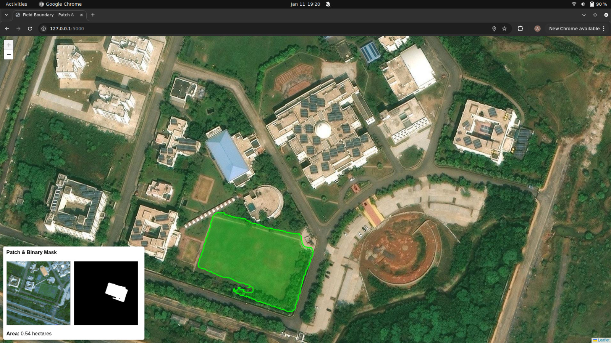
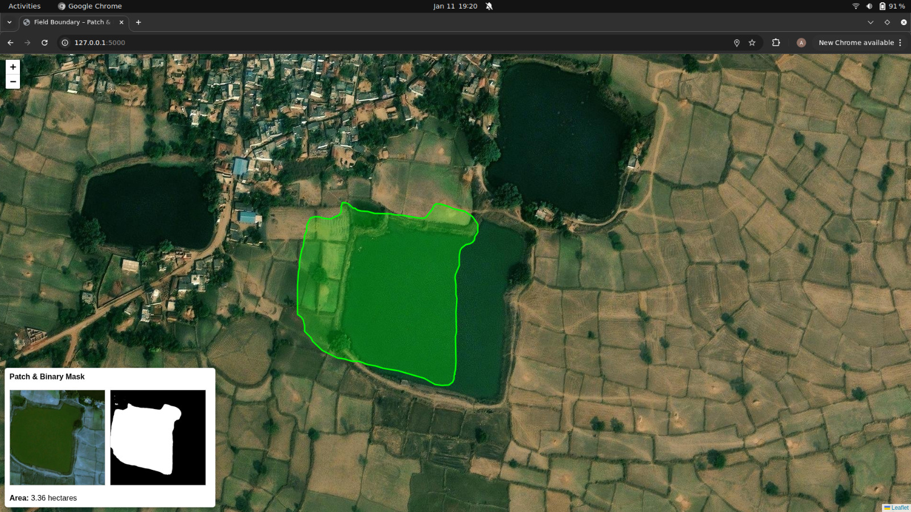

# Crop Identification and Area Mapping

This project focuses on **automatic crop identification and cultivated area estimation** from field images. A user uploads a photo of a crop field, and the system:

1. Identifies the crop type using a **ResNet18 + SIFT gated fusion model**.
2. Extracts image metadata (GPS coordinates) and visualizes the field location on an interactive **Leaflet map**.
3. Segments the crop field using a **pretrained Mobile-SAM model**, fine-tuned on a small dataset of RGB and masked images.
4. Estimates the cultivated area of the detected crop field using pixel-based area computation.

The system is designed to work under varied field conditions, including dry fields, and does not rely on NDVI.

---

## Key Features

* **Crop Detection** from ground-level images
* **Hybrid Deep Learning Model** (ResNet18 + SIFT gated fusion)
* **Field Segmentation** using Mobile-SAM
* **Area Estimation** using pixel-level segmentation
* **Geospatial Visualization** using Leaflet and image metadata
* **Robust to lighting and field conditions**

---

## System Architecture

1. **Input**: Crop field image (with GPS metadata)
2. **Crop Classification**:

   * ResNet18 for deep feature extraction
   * SIFT for local keypoint features
   * Gated fusion module to combine CNN and SIFT features
3. **Segmentation**:

   * Mobile-SAM pretrained and fine-tuned on RGB + mask pairs
4. **Geolocation Mapping**:

   * Latitude and longitude extracted from image metadata
   * Field location displayed using Leaflet
5. **Area Calculation**:

   * Pixel-based cultivated area estimation

---

## Models Used

### 1. Crop Classification Model

* **Backbone**: ResNet18
* **Feature Augmentation**: SIFT descriptors
* **Fusion Strategy**: Gated fusion mechanism
* **Purpose**: Accurate crop identification from field images

### 2. Field Segmentation Model

* **Model**: Mobile-SAM
* **Training Data**: Small custom dataset of RGB images with corresponding field masks
* **Purpose**: Precise crop field boundary detection

---
## Model Evaluation Metrics

The crop classification model was evaluated using standard multi-class classification metrics. The results are as follows:

Accuracy: 0.9085

Macro Precision: 0.9082

Macro Recall: 0.8895

Macro F1-score: 0.8959

## Area Estimation Methodology

The cultivated area of the crop field is calculated using the following relation:

**Area = Npixels × (GSD)²**

Where:

* **Npixels**: Total number of pixels belonging to the segmented crop field
* **GSD (Ground Sample Distance)**: Ground distance represented by one pixel (meters per pixel)

---

## Geospatial Visualization

* Image metadata (EXIF) is used to extract GPS coordinates
* Coordinates are plotted on an interactive **Leaflet map**
* Enables spatial context and location-based analysis of crop fields

---

## Dataset

* **Crop Classification**: Field-level crop images
* **Segmentation**:

  * RGB images
  * Corresponding binary masks of crop fields
* Dataset size kept small to support lightweight deployment

---

## Tech Stack

* **Deep Learning**: PyTorch
* **Computer Vision**: OpenCV, SIFT
* **Segmentation**: Mobile-SAM
* **Mapping**: Leaflet.js
* **Backend**: Python
* **Frontend**: HTML, JavaScript

---

## Use Cases

* Precision agriculture
* Crop monitoring and mapping
* Farm-level area estimation
* Decision support for farmers and researchers

